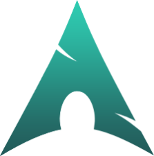
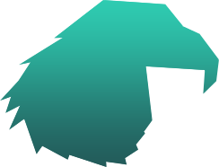

<div align="center">
  
</div>

<div align="center" style="margin-top: -5px;">
  
</div>

<div align="center">
  
</div>

<div align="center">
  <div style="display: flex; flex-wrap: nowrap; justify-content: center; margin-top: -10px;">
    
    
    
    
    
  </div>
</div>

## Features

- Modular configuration
- Wayland-first desktop
- Reproducible setup

## Repository Structure

```text
config/
sddm/
docs/
```

## Acknowledgements

This project incorporates ideas inspired by the following open-source projects:

- **Pixie SDDM Theme** — https://github.com/xCaptaiN09/pixie-sddm

## License

MIT
