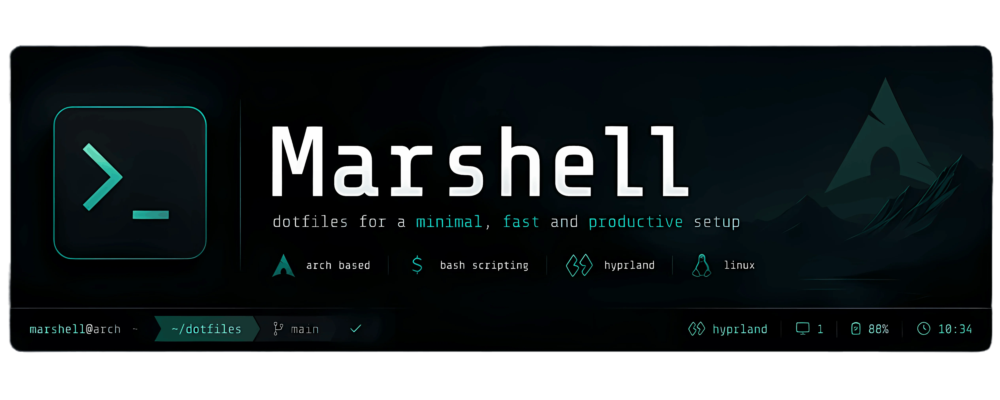
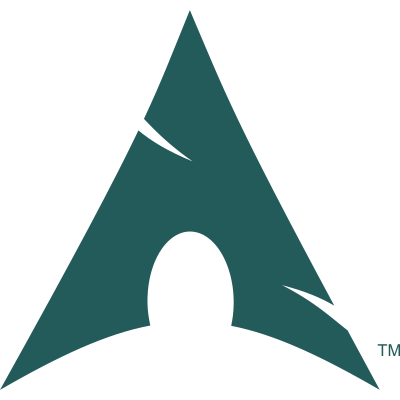

<div align="center">
  
</div>

<div align="center">
  
</div>

<div align="center">
  <p><b><i>Crafting a system that feels like home.</i></b></p>
</div>

<div align="center">
  
  
  
  
</div>
<br>

## Features

- Modular configuration
- Wayland-first desktop
- Reproducible setup

## Repository Structure

```text
config/
sddm/
docs/
```

## Acknowledgements

This project incorporates ideas inspired by the following open-source projects:

- **Pixie SDDM Theme** — https://github.com/xCaptaiN09/pixie-sddm

## License

MIT
