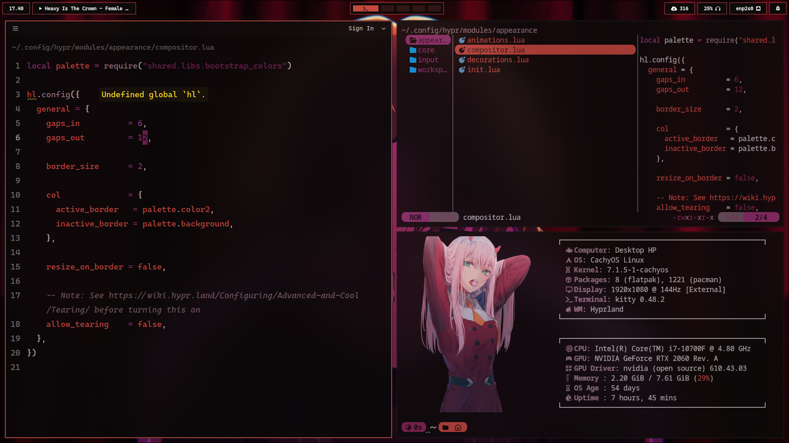
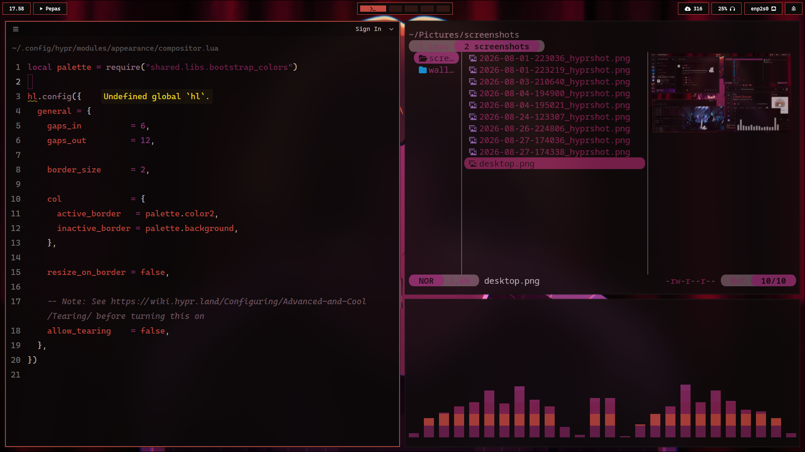
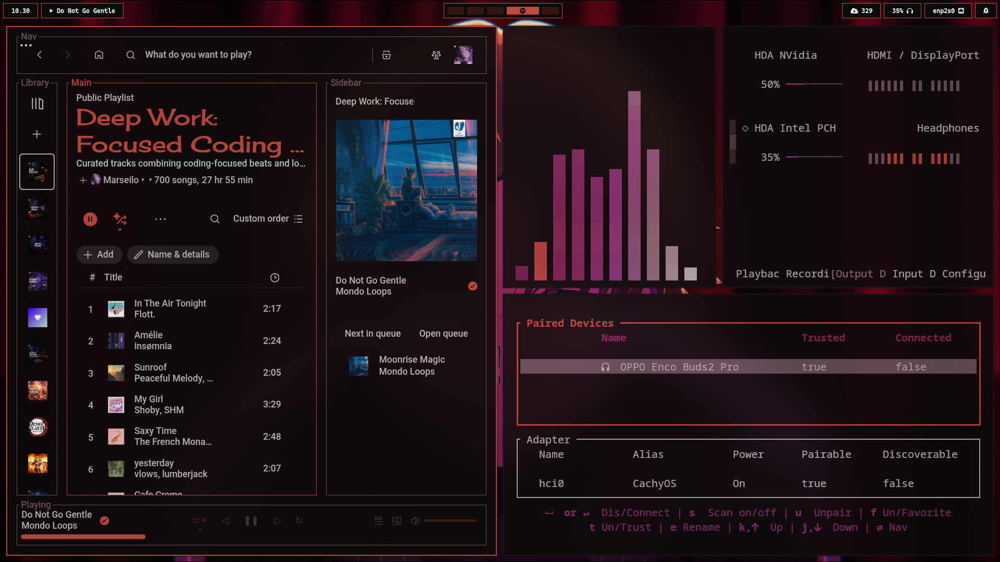
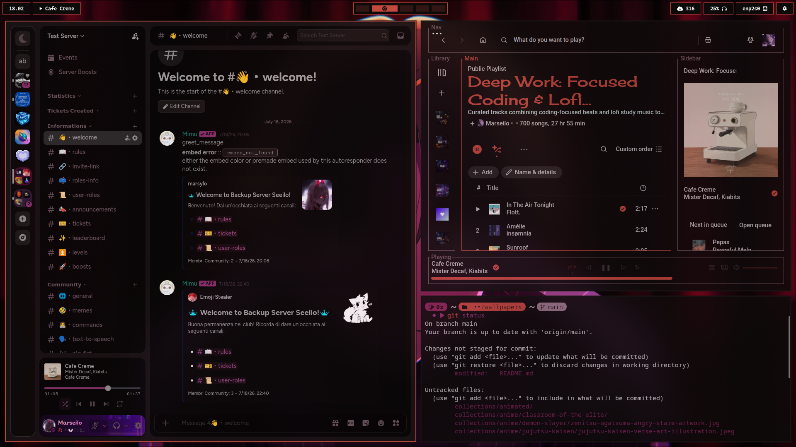
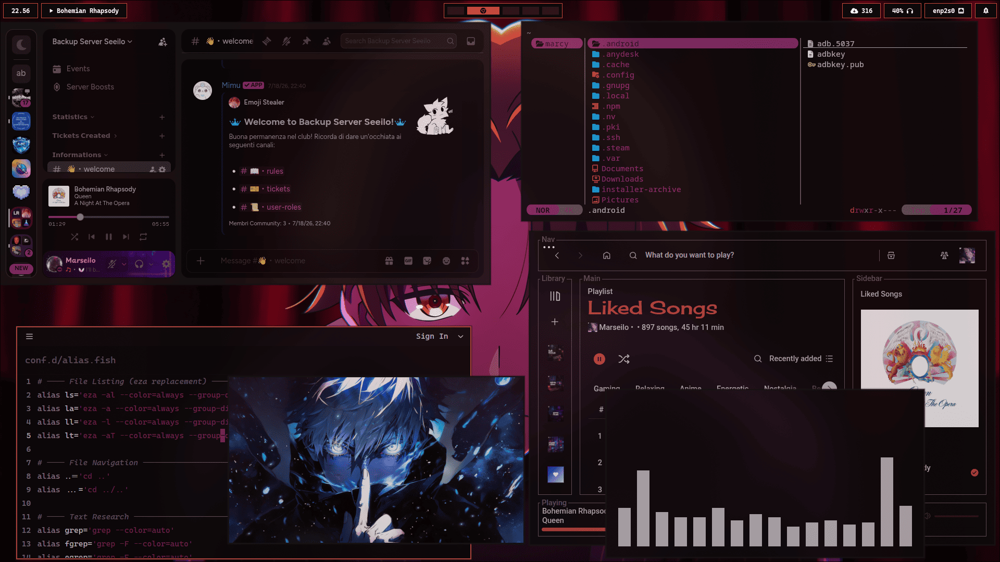

  

  

  

  

    
    
    
    
    
  

  <h2>
    
  </h2>
  

    
  

  
<strong>More previews</strong>

   
  

    
    
    
    
  

  

  

    
    
    
    
    
  

  <h2>
    
  </h2>
  

    
  

  
<strong>More previews</strong>

   
  

    
    
    
    
  

<h2>
  
</h2>

| Component     | Role                                                                  |
| ------------- | --------------------------------------------------------------------- |
| **Hyprland**  | Wayland compositor — configured in Lua, driven through `hyprctl eval` |
| **Waybar**    | Status bar                                                            |
| **Kitty**     | Terminal emulator                                                     |
| **Rofi**      | Application/utility launcher, TOML-driven menu definitions            |
| **yazi**      | Terminal file manager, with custom session management under Kitty     |
| **swaync**    | Notification daemon                                                   |
| **SDDM**      | Display manager                                                       |
| **starship**  | Fish shell prompt                                                     |
| **pywal**     | System-wide color scheme generation and templating                    |
| **Spicetify** | Spotify theming, integrated with the pywal pipeline                   |
| **lazygit**   | Git TUI                                                               |
| **Zed**       | Primary code editor, themed to match the system palette               |

<h2>
  
</h2>

The current palette is a red/crimson theme inspired by **Ayanokoji Kiyotaka** from _Classroom of the Elite_, applied consistently across Hyprland, Waybar, Rofi, Zed, and pywal templates for Zathura, Discord, Spotify and many more — so switching aesthetic direction in the future means updating a small set of source-of-truth files, not hunting through every app's config.

<h2>
  
</h2>

This project incorporates ideas inspired by the following open-source projects:

- **Pixie SDDM Theme** — https://github.com/xCaptaiN09/pixie-sddm
- **End-4 dots** — https://github.com/end-4/dots-hyprland
- **HyDE** — https://github.com/HyDE-Project/HyDE

<h2>
  
</h2>

This project is licensed under the MIT License. For full details, see the [LICENSE](LICENSE) file.
